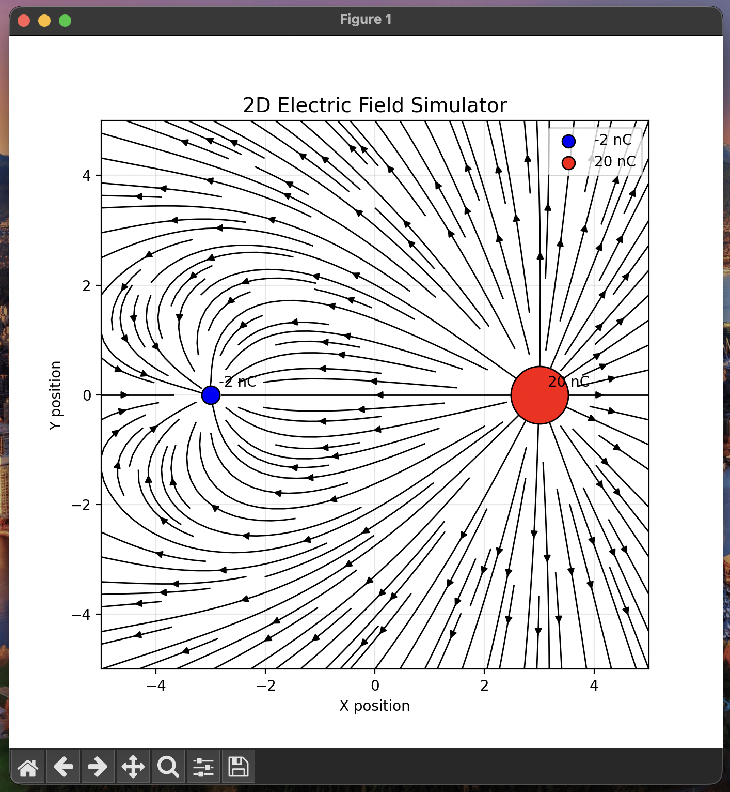
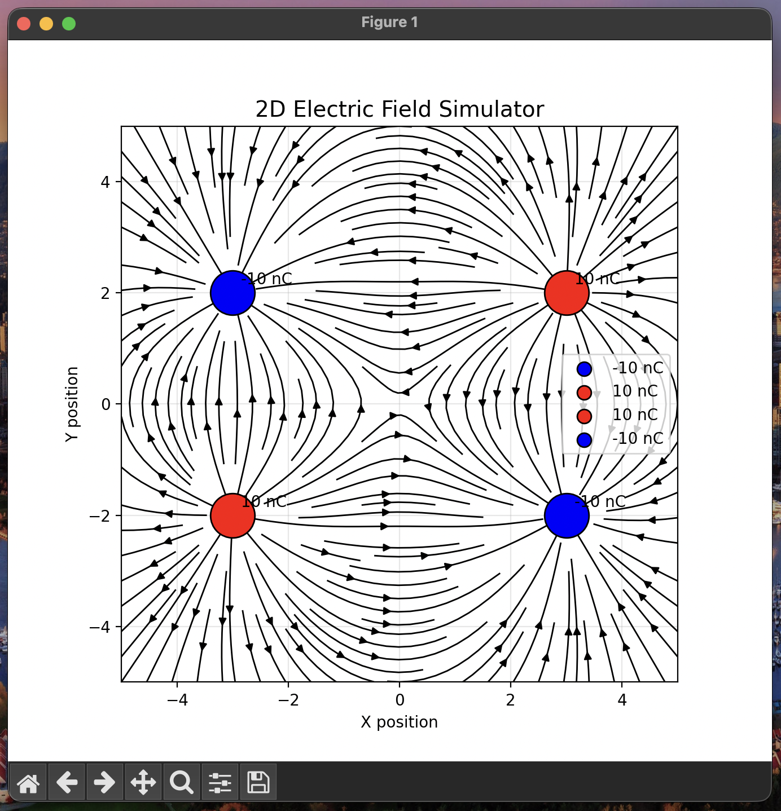

# ⚡ 2D Electric Field Simulator

A Python-based **2D Electric Field Simulator** that calculates and visualizes electric fields generated by multiple point charges using **Coulomb's Law**.

The simulator computes the electric field vector at every point in a 2D space and displays the resulting field lines using streamlines. It supports both positive and negative charges and demonstrates the principle of superposition in electrostatics.

---

## 🖼️ Simulation Results

The simulator can visualize different charge configurations.

### Two Charge System

A simple dipole configuration with one negative and one positive charge:

<p align="center">
  
</p>

---

### Four Charge System

A more complex configuration with multiple interacting charges:

<p align="center">
  
</p>

---

## ✨ Features

- ⚡ Electric field calculation using Coulomb's Law
- 🔴 Positive and 🔵 negative charge visualization
- 📍 Support for multiple point charges
- 🧮 Vector field computation (`Ex`, `Ey`)
- 🌊 Electric field streamline visualization
- 📊 Adjustable simulation resolution
- 📐 Accurate 2D spatial representation
- 🧩 Simple and modular Python implementation

---

# 🧠 Physics Model

The simulator is based on Coulomb's Law.

The electric field generated by a point charge is:

\[
\vec{E} = \frac{kq}{r^2}\hat{r}
\]

Where:

| Symbol      | Meaning                  |
| ----------- | ------------------------ |
| \(E\)       | Electric field magnitude |
| \(k\)       | Coulomb constant         |
| \(q\)       | Charge value             |
| \(r\)       | Distance from charge     |
| \(\hat{r}\) | Direction vector         |

The Coulomb constant is:

\[
k = 9 \times 10^9 \frac{Nm^2}{C^2}
\]

For multiple charges, the total electric field is calculated using the superposition principle:

\[
\vec{E}\_{total} = \sum_i \vec{E_i}
\]

Each charge contributes independently to the final electric field.

---

# ⚙️ How It Works

The simulation follows these steps:

1. Create a 2D coordinate grid.
2. Calculate the distance between every grid point and each charge.
3. Compute the electric field magnitude.
4. Convert the field into horizontal and vertical components:

\[
E_x = E\frac{x-x_q}{r}
\]

\[
E_y = E\frac{y-y_q}{r}
\]

5. Add the contribution of all charges.
6. Display the resulting vector field using streamlines.

---

# 🛠️ Technologies Used

- Python 3
- NumPy
- Matplotlib

---

# 📂 Project Structure

```
Electric-field-simulator/
│
├── electric_field_simulator.py
├── requirements.txt
├── README.md
│
└── images/
    ├── two_charges.png
    └── four_charges.png
```

---

# 🚀 Installation

## 1. Clone the repository

```bash
git clone https://github.com/your-username/Electric-field-simulator.git
```

## 2. Enter the project directory

```bash
cd Electric-field-simulator
```

## 3. Install dependencies

```bash
pip install -r requirements.txt
```

---

# ▶️ Running the Simulator

Run:

```bash
python electric_field_simulator.py
```

A Matplotlib window will open displaying the simulated electric field.

---

# 🔧 Configuration

The simulation parameters can be modified directly in the Python file.

## Define charges

Each charge is represented as:

```python
(x_position, y_position, charge_value_nC)
```

Example:

```python
charges = [
    (-3, 0, -2),
    (3, 0, 20)
]
```

The third value represents the charge magnitude in nano-Coulombs.

---

## Simulation Area

The visualization range can be adjusted:

```python
X_MIN, X_MAX = -5, 5
Y_MIN, Y_MAX = -5, 5
```

---

## Grid Resolution

The field accuracy can be controlled with:

```python
RESOLUTION = 100
```

Higher values create smoother field lines but require more computation.

---

# 📊 Implementation Details

## Electric Field Calculation

The program calculates:

- Distance from every point to each charge
- Electric field magnitude
- Direction vector
- Horizontal component (`Ex`)
- Vertical component (`Ey`)

The final field is the sum of all individual charge contributions.

---

## Visualization

The visualization module:

- Uses Matplotlib `streamplot()` for field lines
- Shows positive charges in red
- Shows negative charges in blue
- Scales charge markers according to magnitude
- Maintains equal axis scaling for accurate geometry

---

# 🔮 Future Improvements

Possible improvements:

- [ ] Interactive charge placement
- [ ] GUI-based simulation
- [ ] Real-time charge movement
- [ ] Electric potential visualization
- [ ] Equipotential lines
- [ ] 3D electric field simulation
- [ ] Animation support
- [ ] Export simulation data

---

# 🎓 Learning Objectives

This project demonstrates:

- Computational physics
- Vector field simulation
- Numerical calculations
- Scientific visualization
- Python engineering practices

---

# 👨‍💻 Author

**Sadra**

Computer Engineering Student

Interested in:

- Computational physics
- Machine learning
- Scientific simulations
- Software engineering

---

# 📜 License

This project is licensed under the MIT License.
